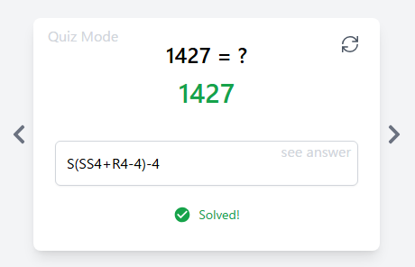
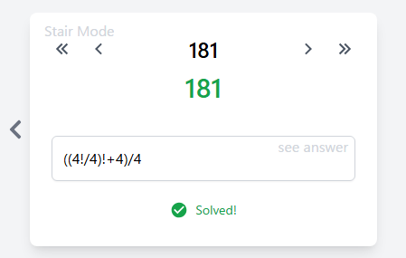

# 概要
4つの4という数字を用いた遊びのアプリケーションです。
[こちら](https://rouhjp.github.io/four-fours-web/)で公開しています。


# 4つの4
4つの4(Four Fours)とは、4を4回使って任意の数字を作り出す数学パズルです。

例えば、0..9までの数は、四則演算を使って表すことができます。

```
0 = 4 + 4 - 4 - 4
```

<details><summary>1..9までの答えを見る</summary>

```
1 = (4 + 4)/(4 + 4)
```

```
2 = 4/4 + 4/4
```

```
3 = (4 + 4 + 4)/4
```

```
4 = 4 + (4 - 4)*4
```

```
5 = (4*4 + 4)/4
```

```
6 = 4 + (4 + 4)/4
```

```
7 = 4 + 4 - 4/4
```

```
8 = 4 + 4*(4/4)
```

```
9 = 4 + 4 + 4/4
```
</details>

<br/>
続いて 10 はどうでしょうか？

通常の四則演算では表現できませんが、`44` を使うことで表せます。

<details><summary>10の答えを見る</summary>

```
10 = (44 - 4)/4
```
</details>

このように、4と演算を組み合わせて任意の数を作り出せるかを考えるゲームです。

## このアプリで採用されている演算
4つの4には、どのような演算が採用するかでいくつかバリエーションがありますが<br/>
このアプリケーションでは以下のルールを採用しています。

### 加算
```
4 + 4 = 8
```

### 減算
```
4 - 4 = 0
```

### 乗算
```
4 * 4 = 16
```

### 除算
```
4 / 4 = 1
```

### 結合

`4` の他に `44` `444` `4444` などを用いることができます。
```
44 + 44 = 88
```

### 小数点

`4.4` など少数点が扱えます。
また、`0.4` の `0` を省略して `.4` と書くことができます。
```
4/.4 = 10
```

```
4.4/.4 = 11
```

### 累乗

`4⁴` のような上付き文字の代わりに `n^m` の記法で累乗を表すことが出来ます。
```
4^4 = 256
```

### 階乗
`(n)!` の記法で1からその数までの総乗を表すことができます。
```
4! = 24
```

```
(4 + 4)! = 40320
```

### 平方根

`√` 記号の代わりに `R(n)` の記法で平方根を表すことができます。
```
R4 = 2
```

```
R(4*4) = 4
```

### 総和

`Σ` 記号の代わりに `S(n)` の記法で1からその数までの総和を表すことができます。

```
S4 = 10
```

```
S(4 + 4) = 36
```

### 負の符号

減算の他に、先頭の要素にもマイナスをつけることができます。
```
-4 + 4 = 0
```

### 括弧

括弧を使うことで演算の順序を制御できます。
```
4*4 + 4 = 20
```

```
4*(4 + 4) = 32
```

# アプリケーションのモード

左右のスライドで3つのモードを遊ぶことが出来ます。

### 自由入力モード

4つの4の式を自由に入力して演算を試すことができます。<br/>
4以外の数字も入力することができます。


### ランダム出題モード

ランダムで `1` .. `3000` の数字が出題されます。<br/>
4つの4を使って出題された数字を作り出すことができれば正解となります。

4以外の数字を入力したり、5つ以上4を使ったりすることもできますが、<br/>
そのような場合は結果が問題の数値と一致しても正解とみなされません。

右上の更新マークを押すことで次の問題に移ります。

入力欄右上の `see answer` をクリックすることで答えが入力されます。



### 階段モード

`1` から順に `3000` まで問題を解いていく究極の暇つぶしモードです。<br/>
ページを更新すると解答がリセットされるのでご注意ください。

数字の左右にある `<` `>` のボタンで問題を移動できます。

入力欄右上の `see answer` をクリックすることで答えが入力されます。



# 開発者向け情報

このアプリケーションはフロントエンドのアプリケーションです。
GitHub Pages で公開しています。

#### ローカルで立ち上げ
```
$ npm run dev
```

### テストの実行
```
$ npm run test
```

#### GitHub Pages にデプロイ
デプロイコマンドを実行すると、gh-pages ブランチに dist ディレクトリがデプロイされ、数分後に公開先に反映されます。

```
$ npm run build
$ npm run deploy
```
